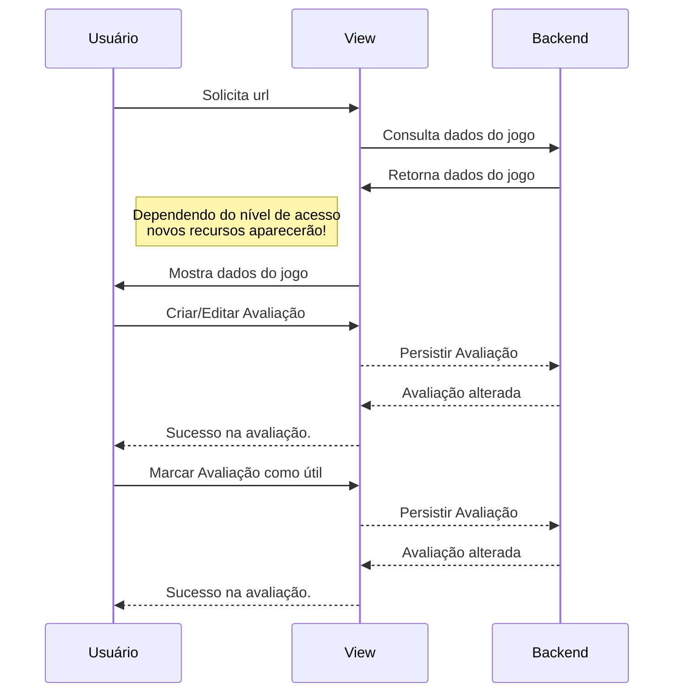
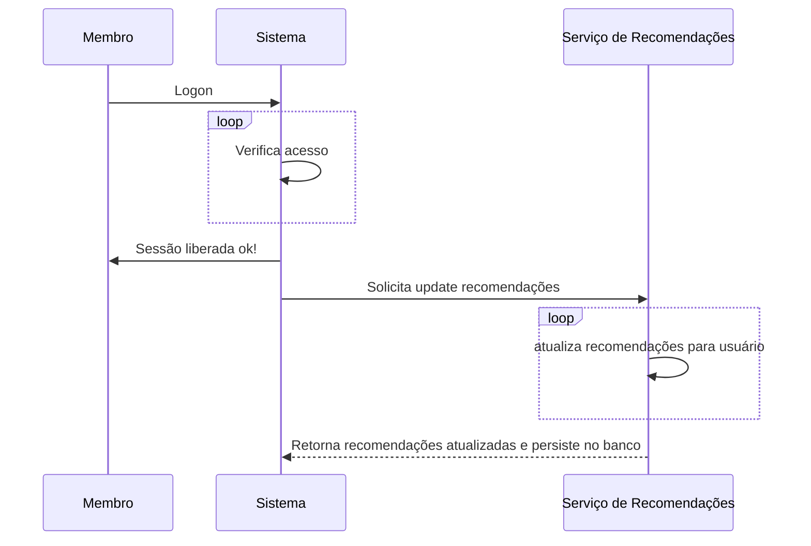

## Uso de casos e funcionalidades
### 1. Primeiro contato com o sistema 1 nívies de acesso
O diagrama abaixo mostra qual comportamento cada tipo de usuário deverá ter com o sistema em seu primeiro contato.

### 2. Logon no Sistema

Uso de Caso   | Acesso a dados protegidos
--------------|------------
Pré-Condições  | Usuário já registrado
Pós-Condições  | Acesso ao conteúdo protegido de acordo com permissão do usuário logado

#### Fluxo Principal 
1. Usuário acessa efetuar login / ou tenta acessar um conteúdo protegido sem estar logado
2. Sistema pede usuario, senha e um captcha (para evitar mútliplas tentativas)
3. Usuário entra com os dados solicitados
4. Sistema verifica o acesso
5. O sistema valida a sessão e passa a permitir os acessos destinados aquele usuário

#### Fluxo alternativo
1. Se a senha estiver inválida o sistema volta ao passo 2 e destaca a pergunta se o usuário esqueceu sua senha

### 3. Cadastro de novos membros

Uso de Caso   | Cadastro de novos usuários
--------------|------------
Pré-Condições  | Preenchimento do formulário de cadastro
Pré-Condições  | Email válido para cadastro
Pós-Condições  | Cadastro de usuário efetuado com sucesso, nível de acesso standard: Membro
Pós-Condições  | Redirecionamento para página inicial

1. Sistema irá pedir os dados de cadastro
2. Usuário irá preencher o formulário
3. O sistema irá fazer uma validação dos dados
4. Caso o formulário foi preencheenchido incorretamente, irá aparecer uma mensagem de erro
5. Caso o formulário foi preenchido corretamente, irá aparecer uma mensagem de sucesso
6. inserção do usuário no banco de dados
7. Redirecionamento do usuário para página inicial

### 4. Cadastro/Edição de Browser Games

Uso de Caso   | Cadastro de Browser Games
--------------|------------
Pré-Condições  | Usuário logado com nível de administrador
Pós-Condições  | Cadastro ou alteração de browser game efetuado com sucesso

### 5. Cadastro/Edição de Categorias

Uso de Caso   | Cadastro de Categorias
--------------|------------
Pré-Condições  | Usuário logado com nível de administrador
Pós-Condições  | Cadastro ou alteração de categoria efetuado com sucesso

### 6. Pesquisa de jogos

Uso de Caso   | Pesquisa de Jogos
--------------|------------
Pré-Condições  | Usuário logado
Pós-Condições  | Lista de jogos conforme tipo de busca

#### Fluxo Principal 
1. Usuário precisará estar logado e navegar até uma interface de busca
2. a busca poderá ser feita pelo nome do jogo (possível inserir o nome parcialmente) e/ou por escolha de uma categoria
3. Usuário entra com os dados solicitados
4. Sistema realiza a busca
5. O sistema retorna a lista de jogos de acordo com a busca

#### Fluxo alternativo
1. Uma tela didática será retornada caso não seja encontrado nenhum jogo durante a busca

**O resultado quando uma lista retornará sempre os jogos ordenados pelo nome alfabeticamente**

### 7. Interface de Jogo

Uso de Caso   | Interface de Jogo
--------------|------------
Pré-Condições  | Usuário logado e jogo escolhido
Pós-Condições  | Dados relevantes a um jogo específico

- Essa interface será mostrada quando um usuário escolher um jogo específico, ela mostrará:  
    - O link do jogo
    - Um video com a demostração do jogo (se possível)
    - Uma descrição de até 255 caracteres do jogo
    - Uma lista de avaliações começando pelas mais úteis e recentes respectivamente, contendo:
        - Uma nota de 1-5 estrelas
        - Texto com a descrição das informações
        - Um campo inteiro mostrando a quantidade de votos útils ele já recebeu
        - *Se houver, uma avaliação separada feita pelo próprio usuário que solicitou essa interface, a ideia é mostrar a avalição do próprio usuário sempre primeira*.
            - A validação já feita por um membro pode ser alterada por ele inúmeras vezes
        - Se administrador o usuário poderá remover qualquer comentário de qualquer membro
Possíveis interações entre usuário e interface de jogo    

### 7. Gestão de Membros

Uso de Caso   | Gestão de Membros
--------------|------------
Pré-Condições  | Usuário logado com nível de administrador
Pós-Condições  | Operar alterações em outros membros

Para fins de administração um administrador poderá excluir qualquer outro membro, ou torná-lo um administrador.
Haverá ainda a opção de o membro ser um administrador garantidor (granter):  
Administradores garantidores podem tornar outros membros administradores e excluir outros administradores.

### 8. Serviço de Atualização de Recomendações
O diagrama abaixo registra quando o serviço de recomendações é disparado para atualizar as recomendações de um determinado membro. Essas recomendações são atualizadas a cada logon do usuário. De forma assíncrona, ou seja, assim que determinado membro é logado um sub-serviço será disparado para atualizar as recomendações.  
**As recomendações sempre serão solicitadas estaticamente daquilo que está no banco de dados no momento da solicitação. O sistema que  eventualemnte atualizará os dados no banco.**

