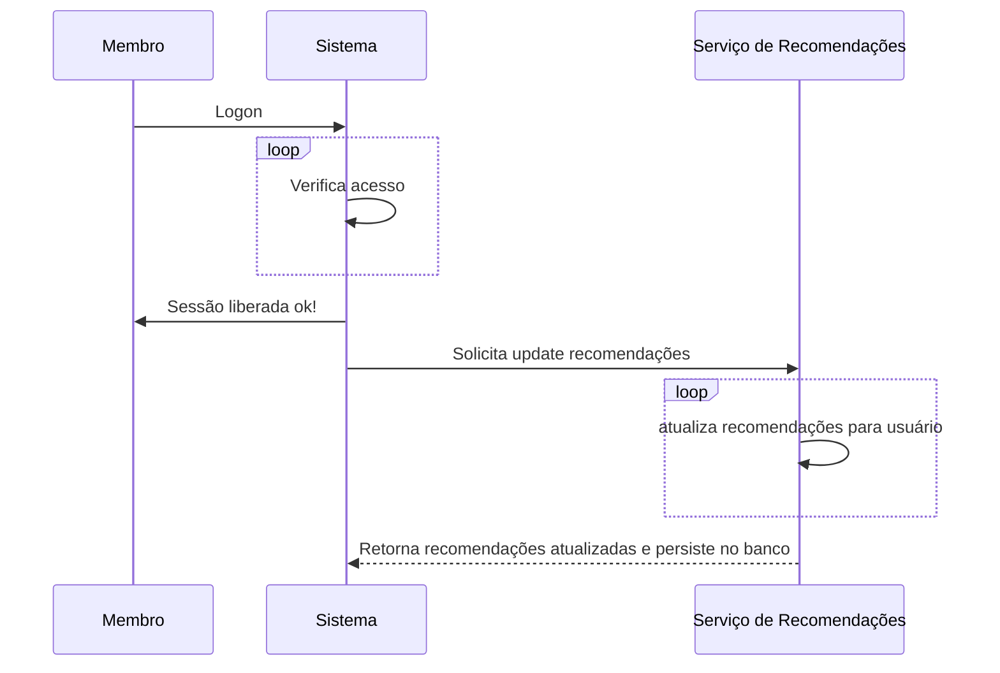

## Usos de Caso
### Serviço de Atualização de Recomendações
O diagrama abaixo registra quando o serviço de recomendações é disparado para atualizar as recomendações de um determinado membro. Essas recomendações são atualizadas a cada logon do usuário. De forma assíncrona, ou seja, assim que determinado membro é logado um sub-serviço será disparado para atualizar as recomendações.  
**As recomendações sempre serão solicitadas estaticamente daquilo que está no banco de dados no momento da solicitação. O sistema que  eventualemnte atualizará os dados no banco.**

