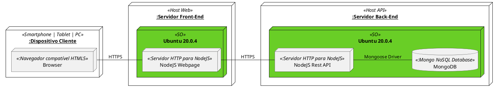

```plantuml
@startuml
left to right direction
node "<u>:Dispositivo Cliente</u>" as device <<Smartphone | Tablet | PC>>{
    node "Browser" as navegador <<:Navegador compatível HTML5>>
}
node "<u>:Servidor Front-End</u>" as server1 <<Host Web>>{
  node "Ubuntu 20.0.4" as ubuntu1 <<SO>> #69ce26{
    node "NodeJS Webpage" as nodejs <<:Servidor HTTP para NodeJS>>
    }
}
node "<u>:Servidor Back-End</u>" as server2 <<Host API>>{
   node "Ubuntu 20.0.4" as ubuntu2 <<SO>> #69ce26{
    node "NodeJS Rest API" as nodejs2 <<:Servidor HTTP para NodeJS>>
    database "MongoDB" as mongo <<:Mongo NoSQL Database>>
    }
}
nodejs -- nodejs2: HTTPS
navegador -- nodejs: HTTPS
nodejs2 -- mongo: Mongoose Driver
@enduml
@enduml
```
